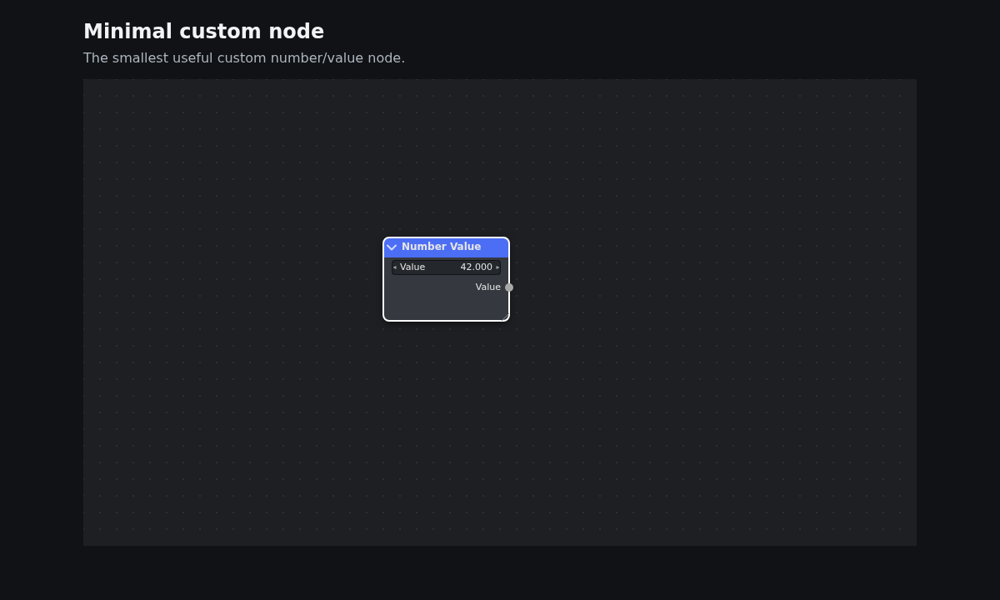
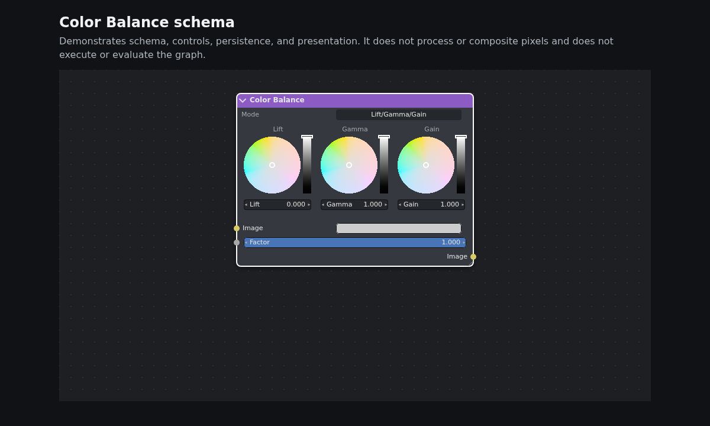
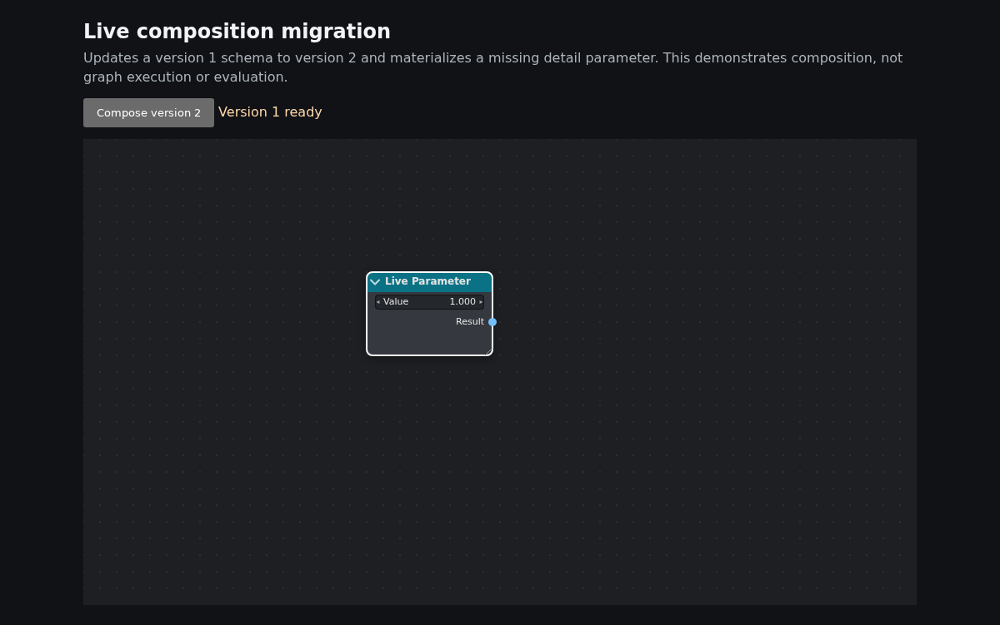

# Examples

The repository has four current experiences. Images below use the examples' existing captured assets—there are no documentation copies.

## Minimal

_A minimal composition and one node. [Source](https://github.com/Heaust-ops/fxnode/blob/main/examples/minimal/main.ts)._

## Color Balance

_A focused custom-widget composition. [Source](https://github.com/Heaust-ops/fxnode/blob/main/examples/color-balance/main.ts)._

## Live composition

_Replacing a node definition and migrating its instance. [Source](https://github.com/Heaust-ops/fxnode/blob/main/examples/live-composition/main.ts)._

## Blender-shaped gallery

The [larger gallery source](https://github.com/Heaust-ops/fxnode/blob/main/examples/blender/main.ts) exercises many node and interaction shapes; it is repository application code, not package authority.

These examples present and persist editable graphs; they do **not evaluate** them. Blender-shaped fixtures and visual regression images do not establish Blender compatibility, behavioral parity, or pixel parity.
